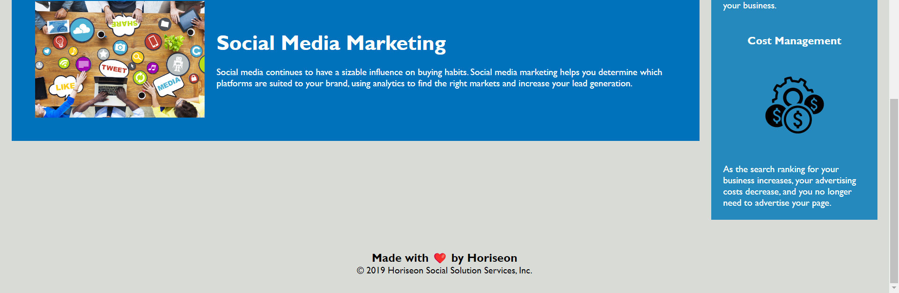

# Horiseon Company Website

## Description

This website was refactored from a provided template to demonstrate and ability to rework and improve existing code while maintaining operational integrity. It contains a landing page and associated style sheets.

## User Story

**AS A** marketing agency

**I WANT** a codebase that follows accessibility standards

**SO THAT** our own site is optimized for search engines

## Acceptance Criteria

**GIVEN** a webpage meets accessibility standards

**WHEN** I view the source code

**THEN** I find semantic HTML elements

**WHEN** I view the structure of the HTML elements

**THEN** I find that the elements follow a logical structure independent of styling and positioning

**WHEN** I view the image elements

**THEN** I find accessible alt attributes

**WHEN** I view the heading attributes

**THEN** they fall in sequential order

**WHEN** I view the title element

**THEN** I find a concise, descriptive title

## Challenge Directives

* Refactor existing HTML and CSS to include semantic elements.
* Ensure stylesheet links are functional.
* Consolidate CSS selectors and properties in a concise and logical manner.
* Arrange CSS selectors to follow semantic structure.
* Provide proper comments in CSS file.
* Make additional changes and leave the file better than you found it.

## Demonstration

Website deployed at eeast.github.io/CH1-HoriseonWebsite/

## Credits

The webpage was normalized using the `normalize.css` file from https://github.com/necolas/normalize.css/

## License

Please refer to the LICENSE in the repo.
